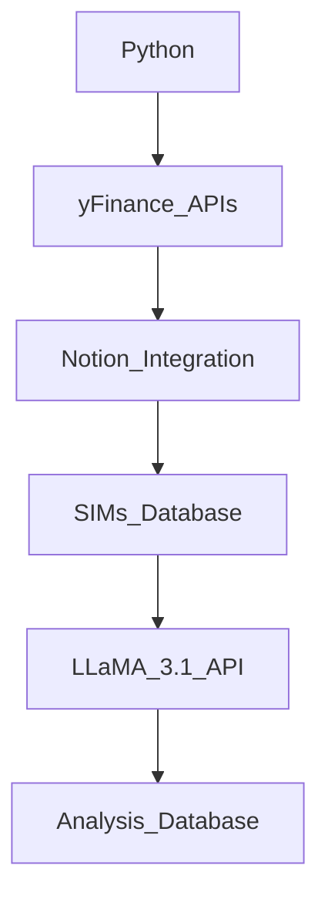

# Daily_SIMs
Simple python program for an AI analyst bot to automate daily collection and analysis of indexes, volatility, energy and metals futures, forex rates and bond yields: Sojourn Insight Metrics (SIMs). 

## Basic Architecture


## Summary of Workflow

1. **Fetch financial data** using yfinance and calculate the percentage changes.
2. **Push this data to a Daily SIMs database** in Notion.
3. **Fetch the latest entry from the Daily SIMs database**.
4. **Prepare context and three prompts** for summary, insight, and watchlist for LLM using the fetched data.
5. **Send each prompt to LLM** for analysis and get the responses.
6. **Push the generated analyses back into the LLM Analysis database** in Notion.

### Key Points:

1. **SIMs Data Fetching and Writing**: The script fetches the current and previous close prices, calculates percentage changes, and writes these as properties to a new page in the Daily SIMs database.
2. **Prompt Preparation**: The script then fetches the latest entry from the Daily SIMs database, prepares the context, and creates prompts for summary, insight, and watchlist generation.
3. **LLaMA API Integration**: The script sends the prompts to the Llama API and receives the generated responses.
4. **Writing Analysis to Notion**: The script writes the generated responses into a new page in the LLM Analysis

## Analyst_AI Daily SIMs Program

### Step 1: Set Up Your Environment

Ensure you have the necessary libraries installed and compatible with your Python version. Here is the list of libraries you need:

- `yfinance`
- `notion_client`
- `torch` (compatible with your system and Python version)
- `llamaapi`

Run these commands to install the required libraries:

- Make sure you have the required libraries installed:
    
    ```bash
    pip install yfinance notion_client torch llamaapi
    ```
    

## Step 2: Customize Integrated Code

### See python_master.py file 

- Make sure you have the necessary tokens, IDs and secrets:
- LLaMa API Token
- Notion Integration Token
- Database ID - Daily SIMs Database
- Database ID - Daily SIMs LLM Analysis Database

### Save custom file locally 

- Note the save location and the location of Python 

    ```bash
    pip where python
    ```
## Step 3: Automate Daily Metric Collection and Analysis:

- Use Python to pull data from APIs like yfinance.
- Schedule the script to run daily using a task scheduler like cron on Unix-based systems or Task Scheduler on Windows.
- The script should create a new entry in the "Daily SIMs" database with the collected metrics and computed fields.

  
